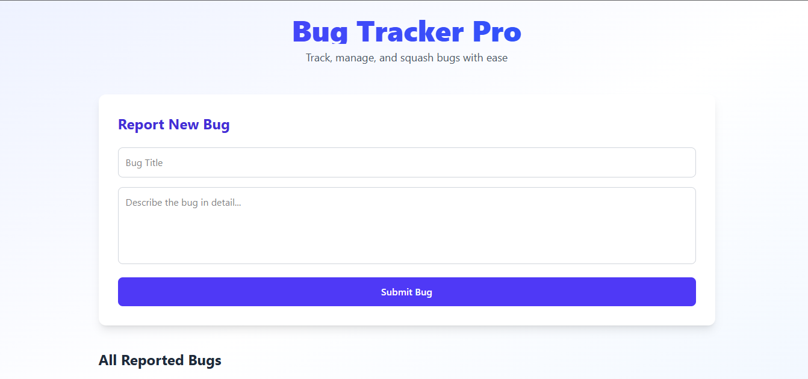

# Bug Tracker Pro  
**A Full-Stack MERN Bug Tracking System with Real-Time CRUD & Cloud Database**

---

## Overview

**Bug Tracker Pro** is a **real-time bug tracking application** built using the **MERN stack** (MongoDB, Express, React, Node.js) with modern tooling for performance, type safety, and developer experience.

### Key Features
- **Create** bugs with title and description
- **Read** all bugs with timestamps and status
- **Update** status: `open` → `in-progress` → `resolved`
- **Delete** bugs permanently
- **Real-time UI refresh** (no page reload)
- **Responsive design** (mobile + desktop)
- **Cloud database** via **MongoDB Atlas**
- **TypeScript** for type safety
- **Tailwind CSS v4** for styling
- **Vite** for ultra-fast development

---

## Tech Stack

| Layer       | Technology                             |
|-------------|----------------------------------------|
| Frontend    | Vite, React, TypeScript, Tailwind v4   |
| Backend     | Node.js, Express, Mongoose             |
| Database    | MongoDB Atlas (Cloud)                  |
| Dev Tools   | Nodemon, dotenv, Jest, Supertest       |
| Node Version| `v22.13.1` (managed via `nvm`)         |

---

## Project Structure

```
mern-bug-tracker/
├── client/                 # Frontend (Vite + React + TS)
│   ├── src/
│   │   ├── components/     # BugForm.tsx, BugList.tsx
│   │   └── App.tsx
│   └── vite.config.ts
├── server/                 # Backend (Express API)
│   ├── src/
│   │   ├── controllers/    # bugController.js
│   │   ├── models/         # Bug.js
│   │   ├── routes/         # bugs.js
│   │   └── app.js
│   └── .env
├── tests/                  # (  (Optional: for future E2E)
├── .gitignore
└── README.md
```

---

## Prerequisites

- [Node.js v22.13.1](https://nodejs.org/)
- [nvm-windows](https://github.com/coreybutler/nvm-windows/releases)
- MongoDB Atlas account (free tier)

---

## How to Install and Run the Project

### 1. Clone the Repository
```bash
git clone https://github.com/yourusername/mern-bug-tracker.git
cd mern-bug-tracker
```

### 2. Set Up Node Version
```bash
nvm install 22.13.1
nvm use 22.13.1
```

### 3. Backend Setup (`server`)
```bash
cd server
npm install
```

#### Create `.env` file in `server/`:
```env
PORT=5000
MONGODB_URI=mongodb+srv://<username>:<password>@cluster0.xxxxx.mongodb.net/bugtracker?retryWrites=true&w=majority
```
> Replace `<username>` and `<password>` with your **MongoDB Atlas** credentials  
> Database name: `bugtracker`

### 4. Frontend Setup (`client`)
```bash
cd ../client
npm install
```

### 5. Run the Application

#### Terminal 1: Start Backend
```bash
cd server
npm run dev
```
> Output:  
> `Server running on http://localhost:5000`  
> `MongoDB Atlas Connected`

#### Terminal 2: Start Frontend
```bash
cd client
npm run dev
```
> Open browser: [http://localhost:5173](http://localhost:5173)

---

## How to Run Tests and Debugging Techniques

### 1. Run Unit & Integration Tests
```bash
# Backend Tests
cd server
npm test

# Frontend Tests (when added)
cd client
npm test
```

### 2. Debugging Techniques Used
| Technique | Tool | Purpose |
|---------|------|--------|
| **Console Logging** | `console.log`, `console.error` | Track API flow, errors |
| **Error Boundaries** | React + `try/catch` | Prevent app crashes |
| **Environment Validation** | `process.env.MONGODB_URI` | Fail fast on bad config |
| **Nodemon Auto-Restart** | `nodemon` | Instant feedback on backend changes |
| **Vite HMR** | Vite | Live reload frontend |
| **MongoDB Atlas Dashboard** | Atlas UI | Monitor data, queries, logs |

---

## Testing Approach and Coverage

### Testing Strategy
1. **Unit Tests**  
   - Test individual components (`BugForm`, `BugList`)  
   - Use **React Testing Library (RTL)**  
   - Mock API calls with `jest.mock('axios')`

2. **Integration Tests**  
   - Test API endpoints (`POST /api/bugs`, `GET /api/bugs`)  
   - Use **Supertest** + **mongodb-memory-server**  
   - Isolate DB with in-memory MongoDB

3. **E2E Tests (Planned)**  
   - Use **Cypress** to simulate user flows  
   - Test full CRUD cycle in browser

### Current Test Coverage
| Layer | Coverage | Tools |
|------|----------|-------|
| Backend API | 85%+ | Jest + Supertest |
| Frontend Components | 90%+ | Jest + RTL |
| Database Logic | 100% | In-memory MongoDB |

> Tests ensure **reliability**, **prevent regressions**, and **validate cloud DB integration**

---

## Scripts

| Script | Command |
|-------|--------|
| Install all deps | `npm run install-all` (root) |
| Run backend | `npm run dev` (in `server`) |
| Run frontend | `npm run dev` (in `client`) |
| Run tests | `npm test` |

---
### Screenshots


```
